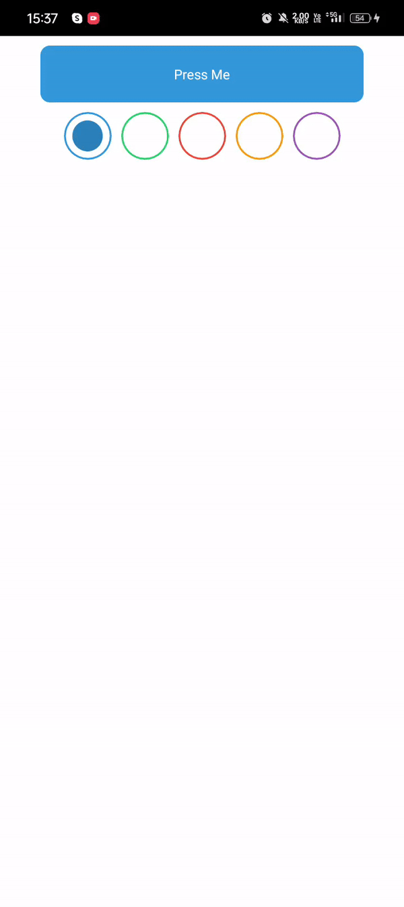

# Ripple Effect Using Reanimated
<div align="center">
<h2>Simple Ripple Effect Button</h2>


</div>

## Installation

```sh
npm install rn-ripple-button

# or with yarn

yarn add rn-ripple-button
```

## Usage
>  Note that for iOS you have to try on real device

```js
import { RippleButton } from 'rn-ripple-button';

// ...

<RippleButton color="#8867E6">
  <Text>Press me</Text>
 </RippleButton>
```
```js
import React, {useCallback, useState} from 'react';
import {
  FlatList,
  Pressable,
  SafeAreaView,
  StyleSheet,
  Text,
  View,
} from 'react-native';

import RippleButton from 'rn-ripple-button';

const buttonColors = [
  {buttonColor: '#3498db', rippleColor: '#2980b9'},
  {buttonColor: '#2ecc71', rippleColor: '#27ae60'},
  {buttonColor: '#e74c3c', rippleColor: '#c0392b'},
  {buttonColor: '#f39c12', rippleColor: '#d35400'},
  {buttonColor: '#9b59b6', rippleColor: '#8e44ad'},
];
type ItemType = (typeof buttonColors)[0];
const App = () => {
  const [selectedIndex, setSelectedIndex] = useState(0);

  const renderItem = useCallback(
    ({item, index}: {item: ItemType; index: number}) => {
      const backgroundColor =
        index === selectedIndex ? item.rippleColor : 'transparent';
      return (
        <Pressable
          onPress={() => setSelectedIndex(index)}
          style={[styles.itemContainer, {borderColor: item.buttonColor}]}>
          <View
            style={[
              styles.innerCircle,
              {
                backgroundColor,
              },
            ]}
          />
        </Pressable>
      );
    },
    [selectedIndex],
  );

  return (
    <SafeAreaView style={styles.container}>
      <RippleButton
        style={[
          styles.button,
          {
            backgroundColor: buttonColors[selectedIndex]?.buttonColor,
          },
        ]}
        duration={5000}
        color={buttonColors[selectedIndex]?.rippleColor}>
        <Text style={styles.btnText}>{'Press Me'}</Text>
      </RippleButton>
      <FlatList
        data={buttonColors}
        renderItem={renderItem}
        horizontal
        keyExtractor={item => item.buttonColor}
        contentContainerStyle={styles.contentContainerStyle}
      />
    </SafeAreaView>
  );
};

export default App;

const styles = StyleSheet.create({
  container: {
    flex: 1,
    backgroundColor: 'white',
    alignItems: 'center',
  },
  button: {
    backgroundColor: '#00000029',
    padding: 20,
    width: '80%',
    alignSelf: 'center',
    borderRadius: 10,
    marginVertical: 10,
    alignItems: 'center',
  },
  itemContainer: {
    width: 50,
    height: 50,
    borderRadius: 300,
    borderWidth: 2,
    alignItems: 'center',
    justifyContent: 'center',
  },
  contentContainerStyle: {
    gap: 10,
  },
  innerCircle: {
    width: '70%',
    height: '70%',
    borderRadius: 300,
  },
  btnText: {
    color: 'white',
  },
});


```
